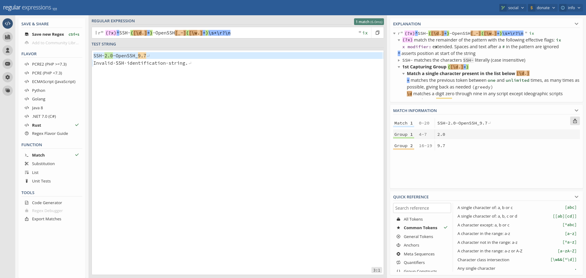

# FingerprintHub

郑重声明：文中所涉及的技术、思路和工具仅供以安全为目的的学习交流使用，任何人不得将其用于非法用途以及盈利等目的，否则后果自行承担。

- 该仓库为侦查守卫(observer_ward)指纹库，[observer_ward](https://github.com/emo-crab/observer_ward)是一个基于社区的指纹识别工具。
- 旧版指纹已经归档在：https://github.com/0x727/FingerprintHub/tree/v3

| 类别 | 说明                                              |
|----|-------------------------------------------------|
| 作者 | [三米前有蕉皮](https://github.com/cn-kali-team)       |
| 团队 | [0x727](https://github.com/0x727) 未来一段时间将陆续开源工具 |
| 定位 | 社区化指纹库，让管理和使用指纹规则更加简单。                          |
| 语言 | Yaml                                            |
| 功能 | 可自定义请求，使用github actions 自动更新指纹库。                |

## 规则说明

- 例子：下面为识别thinkphp的规则

```yaml
id: thinkphp
info:
  name: thinkphp
  author: cn-kali-team
  tags: detect,tech,thinkphp
  severity: info
  metadata:
    product: thinkphp
    vendor: thinkphp
    verified: true
http:
  - method: GET
    path:
      - '{{BaseURL}}/'
    matchers:
      - type: favicon
        hash:
          - f49c4a4bde1eec6c0b80c2277c76e3db
      - type: word
        words:
          - href="http://www.thinkphp.cn">thinkphp</a>
          - thinkphp_show_page_trace
        case-insensitive: true
      - type: word
        words:
          - 'x-powered-by: thinkphp'
        part: header
        case-insensitive: true
```

## 规则组成

- 在设计规则的时候参考了nuclei的template编写规范，将规则分为
    - 基础信息：保存指纹的基本信息，和漏洞关联关系
    - 探针：自定义发送数据包，http和tcp客户端
    - 匹配器：关键词，正则表达式，favicon哈希
    - 提取器：正则表达式，jsonpath

### ID和基础信息

```yaml
id: thinkphp
info:
  name: thinkphp
  author: cn-kali-team
  tags: detect,tech,thinkphp
  severity: info
  metadata:
    product: thinkphp
    vendor: thinkphp
    verified: true
```

| 字段          | 数据类型                    | 描述                                         |
|-------------|-------------------------|--------------------------------------------|
| id          | String                  | 规则ID，命中指纹会在终端打印该字段，不支持中文                   |
| name        | String                  | 规则名称，一般和id一样，或者是它众所周知的别名，支持中文              |
| author      | String                  | 作者列表，一个以逗号隔开的字符串列表                         |
| tags        | String                  | 标签列表，一个以逗号隔开的字符串列表                         |
| severity    | Enum                    | 严重程度：unknown,info,low,medium,high,critical |
| metadata    | HashMap<String,String>  | 元数据，一个字典，可以存放任意类型数据                        |
| description | Option\<String\>        | (可选)描述                                     |
| reference   | Option\<Vec\<String\>\> | (可选)引用参考链接                                 |

- 其中的`metadata`内置有意义的字段
    - 存储了CPE解析后的厂商`vendor`，产品信息`product`和是否已经经过验证`verified`，作用：关联nuclei漏洞验证插件
    - 在服务指纹中储存了版本信息，后面编写服务指纹规则会详细描述

- info中的`metadata`十分重要，它是指纹和漏洞关联的依据。要明白如何进行漏洞关联首先要了解什么是CPE：

> Common Platform Enumeration (CPE) 是由MITRE公司开发的一种标准化格式，用于表示网络设备、软件应用和其他IT资产的身份。在国家漏洞数据库（National
> Vulnerability Database, NVD）中，CPE用于精确描述每个漏洞影响的具体产品和版本。

CPE命名规范包括以下部分：

    核心部分：cpe:/a:vendor:product:version:update:edition:language:sw_edition:target_sw:target_hw:other
        a: 表示应用程序（application）
        vendor 是供应商或制造商的名字
        product 是产品的名称
        version 是主要版本号
        update 是次要版本号或更新版本
        edition 是特定版本（如企业版、标准版等）
        language 是语言环境
        sw_edition 是软件版本（如专业版、家庭版等）
        target_sw 是目标操作系统或其他软件平台
        target_hw 是目标硬件平台
        other 是其他任何相关的信息

    通配符：如果某项未知或不重要，可以使用通配符*代替具体值。

- 例如，一个CPE字符串可能如下所示：cpe:/a:microsoft:windows_10:1903
- NVD中的每个漏洞记录都包含受影响的CPE列表，帮助用户确定其系统是否受到特定漏洞的影响。这使得组织能够更准确地评估风险并采取相应的缓解措施。

- 例如：[CVE-2016-4437](https://scap.kali-team.cn/cve/CVE-2016-4437)这个漏洞
- 可以看到受到影响的产品为`cpe:2.3:a:apache:shiro:*:*:*:*:*:*:*:*`，对这个cpe进行解析后得到类型为应用，厂商为`apache`
  ，产品为`shiro`，就可以编写以下规则：

```yaml
id: shiro
info:
  name: shiro
  author: cn-kali-team
  tags: detect,tech,shiro
  severity: info
  metadata:
    product: shiro
    vendor: apache
    verified: true
```

- 如果我们通过读取`info`中的`metadata`cpe信息就可以反向查询到`CVE-2016-4437`
  和其他[关联了这个cpe的漏洞](https://scap.kali-team.cn/cve/?vendor=apache&product=shiro&size=10)

### 探针

- 探针是引用了nmap的服务指纹的`probe`，在nuclei称`request`，但是我更喜欢`probe`探针
- 探针目前分为`http`和`tcp`两种

#### http探针

```yaml
http:
  - method: GET
    path:
      - '{{BaseURL}}/'
    headers:
      Cookie: rememberMe=admin;rememberMe-K=admin
```

- 多个路径

```yaml
- method: GET
  path:
    - '{{BaseURL}}/'
    - '{{BaseURL}}/nacos/'
```

| 字段      | 数据类型                               | 描述                                                            |
|---------|------------------------------------|---------------------------------------------------------------|
| method  | Enum                               | http请求方式：OPTIONS,GET,POST,PUT,DELETE,HEAD,TRACE,CONNECT,PATCH |
| path    | Vec\<String\>                      | 路径列表，一般只为{{BaseURL}}/，代表首页请求，不建议填写特殊路径，除非首页没有任何特征             |
| headers | Option\<HashMap\<String,String\>\> | (可选)请求头，一个键值对                                                 |
| body    | Option\<String\>                   | (可选)请求体                                                       |

- 支持raw请求，但是不建议在识别指纹规则填写

#### tcp探针

- 使用了[Nmap服务指纹识别](https://nmap.org/book/vscan-fileformat.html)

```yaml
tcp:
  - name: "null"
    inputs:
      - data: ""
        read: 16
    host:
      - "{{Hostname}}"
```

| 字段          | 数据类型             | 描述                                |
|-------------|------------------|-----------------------------------|
| name        | Option\<String\> | 探针名称，对应nmap中的probe_name           |
| inputs.data | String           | 写入数据，会自动反转义，例如：`HTTP/1.0\r\n\r\n` |
| inputs.read | Option\<usize\>  | (可选)读取多少数据长度，默认读取完全部，最多不超过2048字节  |
| host        | Option\<String\> | (可选)主机                            |

### 匹配器

- 匹配器是在探针下面，当前匹配器只会对自己所在的探针响应作出匹配
- 探针

```yaml
matchers:
  - type: favicon
    hash:
      - f49c4a4bde1eec6c0b80c2277c76e3db
  - type: word
    words:
      - href="http://www.thinkphp.cn">thinkphp</a>
      - thinkphp_show_page_trace
    case-insensitive: true
  - type: word
    words:
      - 'x-powered-by: thinkphp'
    part: header
    case-insensitive: true
```

| 字段               | 数据类型             | 描述                                               |
|------------------|------------------|--------------------------------------------------|
| name             | Option\<String\> | 匹配名称，如果不为空并且匹配到结果会返回                             |
| type             | Enum             | 匹配类型：word，favicon，regex                          |
| part             | Enum             | 匹配位置：header,body，默认：body                         |
| favicon.hash     | Vec\<String\>    | 如果是favicon类型：hash为图标hash列表，支持md5和mmh3            |
| word.words       | Vec\<String\>    | 关键词                                              |
| case-insensitive | bool             | 是否忽略大小写，默认为`false`                               |
| negative         | bool             | 是否将匹配结果取反，默认为`false`                             |
| condition        | Enum             | 匹配关系：or,and，当为or时匹配到就立即返回，为and时要全部匹配到才返回结果，默认为or |

#### 关键词

- 当请求httpbin.org目标时，判断body里是否存在`<title>httpbin.org</title>`关键词，并且忽略大小写

```yaml
matchers:
  - type: word
    words:
      - <title>httpbin.org</title>
    case-insensitive: true
```

- 例如：tomcat的规则，多个关键词，必须全部同时匹配

```yaml
matchers:
  - type: word
    words:
      - /manager/html
      - /manager/status
    condition: and
```

#### favicon哈希

- 可以填写多个，只要匹配到一个就算命中指纹
- 不需要在探针填写favicon的路径，工具会在主页html自动提取favicon的链接

```yaml
matchers:
  - type: favicon
    hash:
      - 4644f2d45601037b8423d45e13194c93
      - 其他哈希，支持md5和mmh3
```

### 提取器

- 用于从响应中提前信息返回到结果，例如：提取版本号

#### 正则表达式

- 建议少使用regex，因为初始化加载编译正则需要消耗更多cpu资源，如果有很多正则表达式启动会比较慢。
- 例子：正则一般之用于服务识别，并且为了避免重复编译正则只在提取器中使用，下面为识别ssh服务的规则

```yaml
id: ssh
info:
  name: OpenSSH
  author: cn-kali-team
  tags: detect,tech,ssh,service
  severity: info
  metadata:
    info: protocol $1
    version: $2
tcp:
  - name: "null"
    inputs:
      - data: ""
    host:
      - "{{Hostname}}"
    extractors:
      - name: ssh
        type: regex
        regex:
          - (?x)^SSH-([\d.]+)-OpenSSH[_-]([\w.]+)\s*\r?\n
```

- 在这顺便补充服务指纹中的`metadata`，从上面的`ssh`指纹中可以看到`metadata`有两个键值对，并且存在`$1`和`$2`
  。这里的$后面的数字就是提取器正则对应的提取组

| 字段               | 数据类型             | 描述       |
|------------------|------------------|----------|
| product_name     | Option\<String\> | (可选)产品名称 |
| version          | Option\<String\> | (可选)版本号  |
| info             | Option\<String\> | (可选)信息   |
| hostname         | Option\<String\> | (可选)主机名  |
| operating_system | Option\<String\> | (可选)操作系统 |
| device_type      | Option\<String\> | (可选)设备类型 |
| cpe              | Vec\<String\>    | (可选)通用枚举 |

- 在regex在线平台可以看到，右面的提取组`2.0`和`9.7`会对应替换到上面`metadata`的值，在结果中就会返回`version:[9.7]`
  和`info:[protocol 2.0]`
  

#### jsonpath

- 类似命令行中的jq，例如：从json中提取`origin`的值可以使用下面的提取器

```json
{
  "origin": "1.1.1.1"
}
```

- 然后会在结果中返回`ip:["1.1.1.1"]`

```yaml
extractors:
  - type: json
    name: ip
    json:
      - '.origin'
```

## 如何贡献

### 验证单个指纹是否有效

- 为了方便验证编写的yaml规则是否有效，可以使用`-p`参数指定要验证的yaml文件,`-t`
  指定测试目标对指纹进行验证，并且使用`--debug`参数开启调试输出更多信息。

```bash,no-run
➜ ./observer_ward -t http://httpbin.org -p observer_ward/examples/json.yaml --debug           
[INFO ] 📇probes loaded: 1                                                                                                               
[INFO ] 🎯target loaded: 1                                                                                                               
[INFO ] 🚀optimized probes: 1                                                                                                            
[DEBUG] start: http://httpbin.org/                                                                                                       
[DEBUG] Request {                                                                                                                        
        uri: http://httpbin.org/ip,                                                                                                      
        version: HTTP/1.1,                                                                                                               
        method: GET,                                                                                                                     
        headers: {                                                                                                                       
            "accept": "text/html,application/xhtml+xml,application/xml;q=0.9,image/avif,image/webp,*/*;q=0.8",                           
            "content-type": "application/json",                                                                                          
        },                                                                                                                               
        body: None,                                                                                                                      
        raw_request: None,                                                                                                               
    }
[DEBUG] Response {
        version: HTTP/1.1,
        uri: http://httpbin.org/ip,
        status_code: 200,
        headers: {
            "date": "Mon, 08 Jul 2024 13:19:59 GMT",
            "content-type": "application/json",
            "content-length": "32",
            "connection": "keep-alive",
            "server": "gunicorn/19.9.0",
            "access-control-allow-origin": "*",
            "access-control-allow-credentials": "true",
        },
        extensions: Extensions,
        body: Some(
            {
              "origin": "1.1.1.1"
            }
            ,
        ),
    }
[DEBUG] end: http://httpbin.org/
🏹: http://httpbin.org/
 |_🎯:[ http://httpbin.org/]
 |_🎯:[ http://httpbin.org/ip [httpbin-ip]  <>]
  |_📰: ip:["1.1.1.1"] 
```

### 提交指纹规则

- 点击Fork按钮克隆这个项目到你的仓库

```bash,no-run
git clone git@github.com:你的个人github用户名/FingerprintHub.git
```

- 添加上游接收更新

```bash,no-run
cd FingerprintHub
git remote add upstream git@github.com:0x727/FingerprintHub.git
git fetch upstream
```

- 配置你的github个人信息

```bash,no-run
git config --global user.name "$GITHUB_USERNAME"
git config --global user.email "$GITHUB_EMAIL"
git config --global github.user "$GITHUB_USERNAME"
```

- 拉取所有分支的规则

```bash,no-run
git fetch --all
git fetch upstream
```

- **不要**直接在`main`分支上修改，例如我想添加一个`thinkphp`的指纹，创建一个新的分支并切换到新的分支。

```bash,no-run
git checkout -b thinkphp
```

- 复制一份指纹规则文件，修改文件名和你想要提交的组件名一样，修改yaml文件里面的`name`字段为添加的组件名，添加或者修改规则。
- 跟踪修改和提交Pull-Requests，合并指纹。

```bash,no-run
git add 你添加或者修改的文件名
git commit -m "添加的组件名或者你的描述"
git push origin thinkphp
```

- 打开你Fork这个项目的地址，点击与上游合并，等待审核合并指纹。

### 谁在使用FingerprintHub

- 如果你的开源工具中也使用了`FingerprintHub`，我感到非常的荣幸，欢迎补充列表，当项目有破坏性更新时可以及时通知到你。

| [observer_ward](https://github.com/emo-crab/observer_ward) |
|------------------------------------------------------------|
| [nuclei](https://github.com/projectdiscovery/nuclei)       |
| [nemo_go](https://github.com/hanc00l/nemo_go)              |
| [afrog](https://github.com/zan8in/afrog)                   |
| [ShuiZe](https://github.com/0x727/ShuiZe_0x727)            |
| [z0scan](https://github.com/JiuZero/z0scan)                |

### 指纹反馈

- 当前指纹库收集于互联网，虽然已经经过了人工整理，但是难免会有以下情况：
    - 出现误报，当指纹不够精确时会产生识别不准确的情况。
    - 组件重复，可能出现多个组件名称，但是都是同一个组件。
    - 识别不出组件，指纹规则覆盖不到。
- 出现上面情况可以提交**issues**，可以附上演示URL地址，如果不方便演示可以提交首页的HTML源码，我们会人工修正指纹规则。

### 谢谢

- 感谢您的关注和支持！
